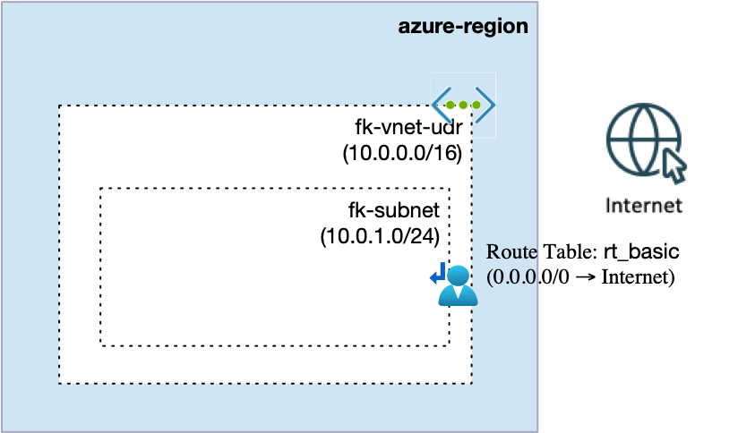
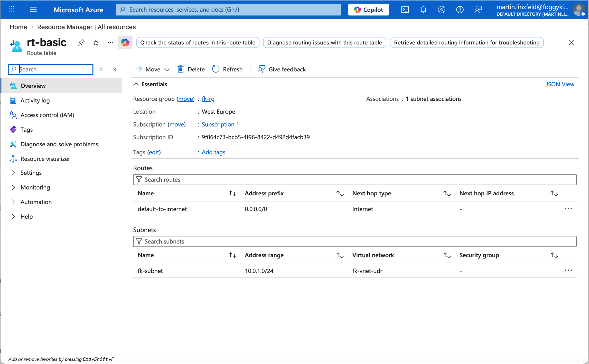

# Example 01: Azure User Defined Route (Basic)

In this example, we deploy **one Azure Virtual Network (VNet)** with a **single subnet** and attach a **User Defined Route (UDR) table** to that subnet using Terraform/OpenTofu.

This is a basic starting point for controlling egress and subnet-level routing behavior in Azure.

---

## 🧭 Architecture Overview



This deployment creates:

- A Resource Group
- One Virtual Network:
  - fk-vnet-udr (10.0.0.0/16)
- One subnet:
  - fk-subnet (10.0.1.0/24)
- One route table:
  - rt-basic
- One route in the route table:
  - default-to-internet (0.0.0.0/0 → Internet)
- One subnet association between `rt-basic` and `fk-subnet`

Once applied, the subnet uses the custom route table managed by this module.

---

## 🚀 Deployment Steps

Initialize and apply the configuration:

```bash
tofu init
tofu plan
tofu apply
```

After deployment, Terraform will output:

- VNet ID
- Subnet ID
- Route table IDs

---

## 🖼️ Azure Portal Verification



After deployment, verify the following in Azure Portal:

### Virtual Network
- fk-vnet-udr

### Subnet
- fk-subnet (10.0.1.0/24)

### Route Table
- rt-basic

### Route
- default-to-internet
- Address prefix: 0.0.0.0/0
- Next hop type: Internet

### Subnet Association
- `fk-subnet` is associated with `rt-basic`

This confirms that the subnet is using the custom route table created by the routing module.

---

## 🧠 Design Notes

- UDRs are applied at the **subnet** level in Azure
- A route table can contain multiple custom routes
- A route table can be associated with one or more subnets
- Default route entries such as `0.0.0.0/0` are commonly used to control outbound traffic behavior

This is a foundational building block for:

- Hub-and-spoke routing patterns
- Forced tunneling scenarios
- Azure Firewall or NVA-based egress designs

---

## 🧹 Cleanup

To remove all resources:

```bash
tofu destroy
```

---

## ✅ Summary

This example demonstrates:

- How to create an Azure route table with a custom route
- How to associate a route table with a subnet
- The foundation for more advanced Azure routing architectures

---

## 🌐 Learn More

This example is part of the FoggyKitchen training ecosystem.

Continue your journey:

👉 https://foggykitchen.com/courses/azure-fundamentals-terraform-course/

---

## 🪪 License

Licensed under the Universal Permissive License (UPL), Version 1.0.
