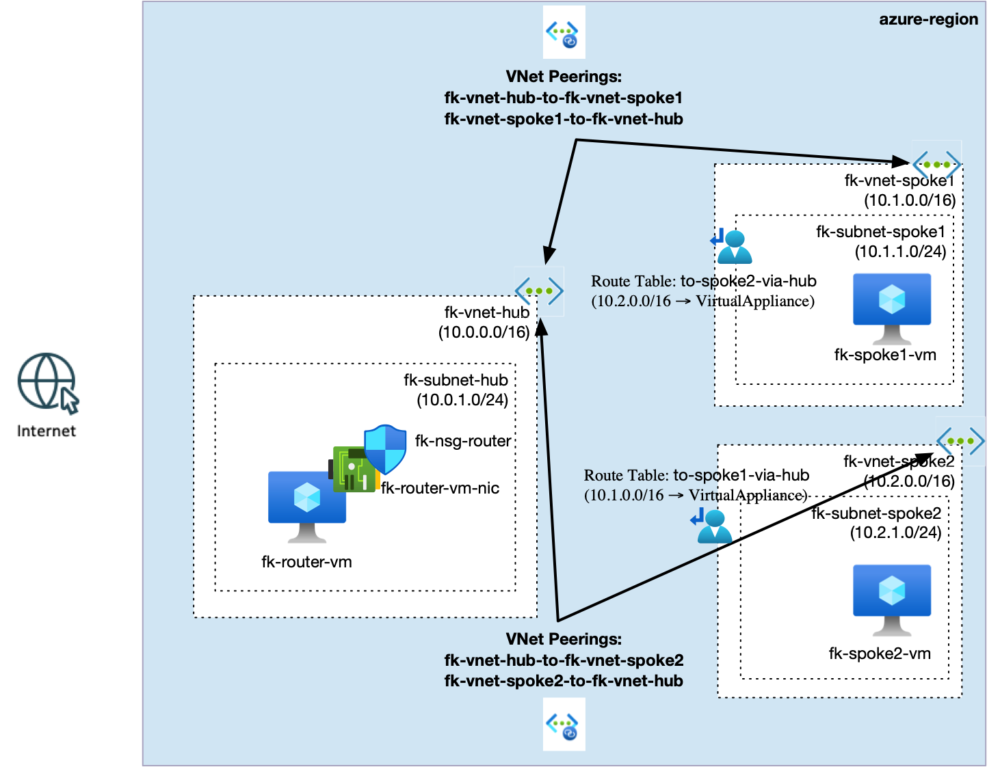
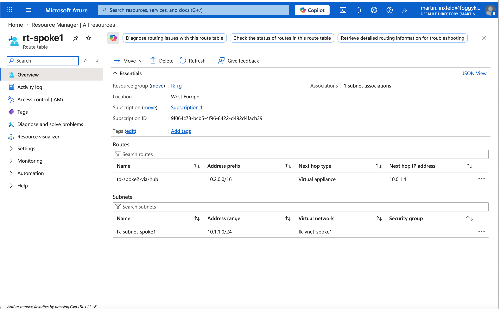

# Example 02: Azure Hub-and-Spoke with Router VM Transit Routing

In this example, we deploy a **Hub-and-Spoke network topology** in Azure with Terraform/OpenTofu and extend it with **User Defined Routes (UDRs)** so that **Spoke1 can communicate with Spoke2 and vice versa** through the Hub.

The Hub contains a **Linux router VM** built with `terraform-az-fk-compute`, and the VM NIC is protected with an **NSG** built with `terraform-az-fk-nsg`. Both spoke subnets use route tables that send inter-spoke traffic to the router VM private IP.

To make testing possible, the example also deploys **one Linux VM in Spoke1** and **one Linux VM in Spoke2**.

The SSH key pair is generated locally by `tls.tf`, following the same pattern used in [terraform-az-fk-compute](https://github.com/mlinxfeld/terraform-az-fk-compute/blob/main/examples/01_single_vm/tls.tf).

## Architecture Overview



This deployment creates:

- A Resource Group
- Three Virtual Networks:
  - `fk-vnet-hub` (`10.0.0.0/16`)
  - `fk-vnet-spoke1` (`10.1.0.0/16`)
  - `fk-vnet-spoke2` (`10.2.0.0/16`)
- Hub subnets:
  - `fk-hub-subnet` (`10.0.1.0/24`)
- One subnet in each spoke:
  - `fk-subnet-spoke1` (`10.1.1.0/24`)
  - `fk-subnet-spoke2` (`10.2.1.0/24`)
- Bidirectional VNet peering:
  - Hub ↔ Spoke1
  - Hub ↔ Spoke2
- One router VM in the Hub subnet:
  - `fk-router-vm`
  - static IP `10.0.1.4` by default
- One NSG attached to the router VM NIC:
  - `fk-nsg-router`
- One test VM in each spoke subnet:
  - `fk-spoke1-vm` (`10.1.1.4`)
  - `fk-spoke2-vm` (`10.2.1.4`)
- Two route tables:
  - `rt-spoke1`
  - `rt-spoke2`
- Two spoke routes:
  - `to-spoke2-via-hub` on Spoke1
  - `to-spoke1-via-hub` on Spoke2

With this design:

- Traffic from `Spoke1` to `Spoke2` is sent to the Hub router VM
- Traffic from `Spoke2` to `Spoke1` is sent to the Hub router VM
- The Hub becomes the transit point for inter-spoke routing

## Why UDR Is Needed

Regular VNet peering is **non-transitive**. That means:

- `Spoke1` can talk to `Hub`
- `Spoke2` can talk to `Hub`
- But `Spoke1` cannot automatically talk to `Spoke2` through `Hub`

To make spoke-to-spoke communication work, this example adds:

- `allow_forwarded_traffic = true` on the peerings
- UDRs on both spoke subnets with `next_hop_type = "VirtualAppliance"`
- A router VM in the Hub with Azure NIC IP forwarding enabled
- Linux IP forwarding enabled through `custom_data`
- An NSG on the router NIC allowing traffic from both spokes

This makes the Hub VNet a working **transit routing layer**.

## Deployment Steps

Initialize and apply the configuration:

```bash
tofu init
tofu plan
tofu apply
```

No manual SSH public key input is required, because the example generates one automatically.

After deployment, Terraform will output:

- Hub, Spoke1, and Spoke2 VNet IDs
- Router VM ID
- Router private IP
- Router NSG ID
- Spoke1 VM ID and private IP
- Spoke2 VM ID and private IP
- Route table IDs
- Peering IDs

## Azure Portal Verification

After deployment, verify the following in Azure Portal:



The screenshot above shows `rt-spoke1` and its route configuration:

- Route table: `rt-spoke1`
- Route: `to-spoke2-via-hub`
- Address prefix: `10.2.0.0/16`
- Next hop type: `Virtual appliance`
- Next hop IP: `10.0.1.4`

In this design, `10.0.1.4` is the private IP of `fk-router-vm`, exposed on `fk-router-vm-nic`.


The second screenshot shows the reverse direction on `rt-spoke2`:

- Route table: `rt-spoke2`
- Route: `to-spoke1-via-hub`
- Address prefix: `10.1.0.0/16`
- Next hop type: `Virtual appliance`
- Next hop IP: `10.0.1.4`

This confirms that both spokes route inter-spoke traffic to the same Hub router VM.

### Hub VNet
- `fk-vnet-hub` (`10.0.0.0/16`)
- `fk-hub-subnet` (`10.0.1.0/24`)

### Router VM
- `fk-router-vm`
- Private IP: `10.0.1.4` by default
- NIC IP forwarding enabled
- Linux IP forwarding enabled via cloud-init

### Router NSG
- `fk-nsg-router`
- Attached to the router VM NIC

### Spoke VNets
- `fk-vnet-spoke1` (`10.1.0.0/16`)
- `fk-subnet-spoke1` (`10.1.1.0/24`)
- `fk-vnet-spoke2` (`10.2.0.0/16`)
- `fk-subnet-spoke2` (`10.2.1.0/24`)

### Test VMs
- `fk-spoke1-vm` with private IP `10.1.1.4`
- `fk-spoke2-vm` with private IP `10.2.1.4`

### VNet Peering
- `fk-vnet-hub -> fk-vnet-spoke1` (`Connected`)
- `fk-vnet-spoke1 -> fk-vnet-hub` (`Connected`)
- `fk-vnet-hub -> fk-vnet-spoke2` (`Connected`)
- `fk-vnet-spoke2 -> fk-vnet-hub` (`Connected`)

### Peering Settings
- Allow virtual network access ✅
- Allow forwarded traffic ✅

### Route Tables
- `rt-spoke1` associated with `fk-subnet-spoke1`
- `rt-spoke2` associated with `fk-subnet-spoke2`

### Routes
- `rt-spoke1`: `10.2.0.0/16 -> VirtualAppliance -> 10.0.1.4`
- `rt-spoke2`: `10.1.0.0/16 -> VirtualAppliance -> 10.0.1.4`

This confirms that both spokes use the Hub router VM as the transit appliance.

## Testing Connectivity

The simplest way to verify transit routing is to use **Run command** in Azure Portal on one of the spoke VMs.

Example:

1. Open `fk-spoke1-vm` in Azure Portal
2. Go to `Run command` and choose `RunShellScript`
3. Run:

```bash
ping -c 4 10.2.1.4
traceroute 10.2.1.4
```

Expected result:

- `ping` should succeed
- `traceroute` should show the path leaving `Spoke1`, crossing the Hub router, and reaching `Spoke2`

You can repeat the same test in the opposite direction from `fk-spoke2-vm` to `10.1.1.4`.

## Validated Result

This example was validated after deployment using Azure CLI `run-command` from `fk-spoke2-vm` toward `fk-spoke1-vm`.

Command used:

```bash
az vm run-command invoke \
  -g fk-rg \
  -n fk-spoke2-vm \
  --command-id RunShellScript \
  --scripts "ping -c 4 10.1.1.4" "traceroute 10.1.1.4"
```

Observed result:

- `ping` succeeded with `4/4` replies and `0%` packet loss
- `traceroute` showed the traffic passing through the Hub router VM

Relevant path:

```text
1  10.0.1.4
2  10.1.1.4
```

This confirms that traffic from `Spoke2` to `Spoke1` is routed through the Hub router VM as designed.

## Design Notes

- VNet peering by itself is non-transitive
- UDRs need a forwarding device, which in this example is a Linux VM in the Hub
- `allow_forwarded_traffic` must be enabled so forwarded packets from the Hub can traverse the peerings
- Azure NIC IP forwarding and OS-level IP forwarding are both required
- This pattern is useful when you want a lightweight, low-cost transit appliance instead of Azure Firewall

This is a practical foundation for:

- Spoke-to-spoke communication through a Hub
- Lightweight NVA and Linux router patterns
- Controlled east-west traffic inspection
- Enterprise hub-and-spoke network design

## Cleanup

To remove all resources:

```bash
tofu destroy
```

## Summary

This example demonstrates:

- How to build a Hub-and-Spoke topology in Azure
- How to deploy a router VM in the Hub using `terraform-az-fk-compute`
- How to protect the router VM NIC using `terraform-az-fk-nsg`
- How to deploy test VMs in both spokes for end-to-end validation
- How to use UDRs so `Spoke1` can reach `Spoke2` and vice versa through the Hub

## Learn More

This example is part of the FoggyKitchen training ecosystem.

Continue your journey:

👉 https://foggykitchen.com/courses/azure-fundamentals-terraform-course/

## License

Licensed under the Universal Permissive License (UPL), Version 1.0.
