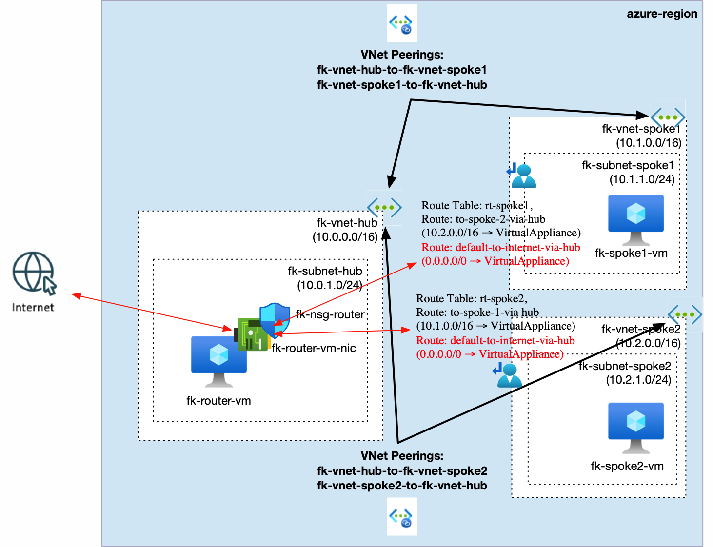
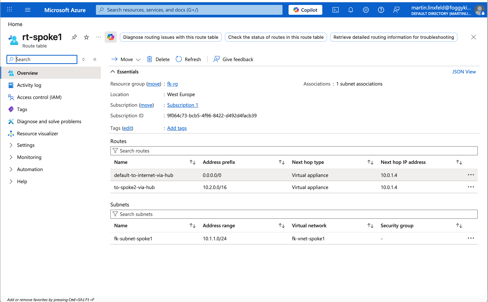
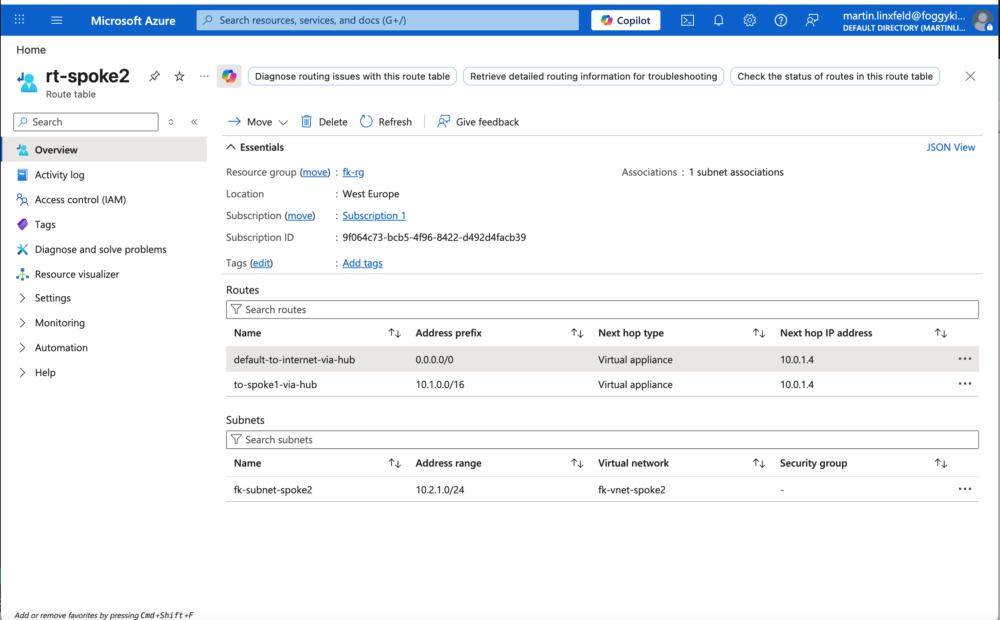

# Example 03: Azure Forced Tunneling via Hub Router VM

In this example, we deploy a **Hub-and-Spoke network topology** in Azure with Terraform/OpenTofu and extend it with **forced tunneling** so that outbound Internet traffic from both spokes is sent through a router VM in the Hub.

This example reuses the same architectural building blocks as **Example 02**, but adds **default routes (`0.0.0.0/0`)** pointing to the Hub router VM. The router performs IP forwarding and NAT so spoke VMs can reach the Internet through the Hub instead of using direct default outbound routing.

To make validation possible, the example also deploys one Linux VM in each spoke.

## Architecture Overview



This deployment creates:

- A Resource Group
- Three Virtual Networks:
  - `fk-vnet-hub` (`10.0.0.0/16`)
  - `fk-vnet-spoke1` (`10.1.0.0/16`)
  - `fk-vnet-spoke2` (`10.2.0.0/16`)
- Hub subnet:
  - `fk-hub-subnet` (`10.0.1.0/24`)
- One subnet in each spoke:
  - `fk-subnet-spoke1` (`10.1.1.0/24`)
  - `fk-subnet-spoke2` (`10.2.1.0/24`)
- Bidirectional VNet peering:
  - Hub ↔ Spoke1
  - Hub ↔ Spoke2
- One router VM in the Hub subnet:
  - `fk-router-vm`
  - static IP `10.0.1.4` by default
- One NSG attached to the router VM NIC:
  - `fk-nsg-router`
- One test VM in each spoke subnet:
  - `fk-spoke1-vm` (`10.1.1.4`)
  - `fk-spoke2-vm` (`10.2.1.4`)
- Two route tables:
  - `rt-spoke1`
  - `rt-spoke2`
- Four spoke routes:
  - Inter-spoke route via Hub router
  - Default route `0.0.0.0/0` via Hub router

With this design:

- Traffic from `Spoke1` to `Spoke2` is sent to the Hub router VM
- Traffic from `Spoke2` to `Spoke1` is sent to the Hub router VM
- Outbound Internet traffic from both spokes is also sent to the Hub router VM
- The router VM performs forwarding and NAT for egress traffic

## Why Forced Tunneling Is Needed

Regular VNet peering is **non-transitive**, and spoke VMs normally use Azure system routes for direct Internet egress.

To centralize egress through the Hub, this example adds:

- `allow_forwarded_traffic = true` on the peerings
- UDRs on both spoke subnets with:
  - inter-spoke routes via the Hub router
  - `0.0.0.0/0` via the Hub router
- A router VM in the Hub with Azure NIC IP forwarding enabled
- Linux IP forwarding enabled through `custom_data`
- NAT rules on the router VM using `iptables`
- An NSG on the router NIC allowing traffic from both spokes and outbound Internet traffic

This makes the Hub VNet the **central egress path** for spoke workloads.

## Deployment Steps

Initialize and apply the configuration:

```bash
tofu init
tofu plan
tofu apply
```

No manual SSH public key input is required, because the example generates one automatically.

After deployment, Terraform will output:

- Hub, Spoke1, and Spoke2 VNet IDs
- Router VM ID
- Router private IP
- Router NSG ID
- Spoke1 VM ID and private IP
- Spoke2 VM ID and private IP
- Route table IDs
- Peering IDs

## Validation Ideas

After deployment, you can validate:

- Inter-spoke routing:
  - `ping 10.2.1.4` from `fk-spoke1-vm`
  - `ping 10.1.1.4` from `fk-spoke2-vm`
- Forced tunneling for Internet egress:
  - `curl https://api.ipify.org`
  - `curl https://ifconfig.me`
  - `traceroute 8.8.8.8`

Expected result:

- Inter-spoke traffic should traverse the Hub router VM
- Outbound Internet traffic should also leave through the Hub router VM

## Validated Result

The example was validated after a successful `tofu apply` by using Azure CLI `Run Command`.

Router VM validation:

```bash
az vm run-command invoke \
  -g fk-rg \
  -n fk-router-vm \
  --command-id RunShellScript \
  --scripts "sysctl net.ipv4.ip_forward; iptables -t nat -S; iptables -S FORWARD"
```

Confirmed on `fk-router-vm`:

- `net.ipv4.ip_forward = 1`
- NAT rules present for:
  - `10.1.0.0/16 -> MASQUERADE`
  - `10.2.0.0/16 -> MASQUERADE`
- Forwarding rules present for:
  - `Spoke1 -> Spoke2`
  - `Spoke2 -> Spoke1`
  - outbound Internet egress from both spokes

Spoke validation:

```bash
az vm run-command invoke \
  -g fk-rg \
  -n fk-spoke1-vm \
  --command-id RunShellScript \
  --scripts "ping -c 2 10.2.1.4; curl -4S --max-time 20 https://api.ipify.org"

az vm run-command invoke \
  -g fk-rg \
  -n fk-spoke2-vm \
  --command-id RunShellScript \
  --scripts "ping -c 2 10.1.1.4; curl -4S --max-time 20 https://api.ipify.org"
```

Observed results:

- `fk-spoke1-vm -> 10.2.1.4`: `2/2` ICMP replies
- `fk-spoke2-vm -> 10.1.1.4`: `2/2` ICMP replies
- `curl https://api.ipify.org` returned `51.124.159.143` from both spoke VMs

This confirms:

- east-west routing between the spokes works through the Hub router VM
- outbound HTTP/HTTPS egress from both spokes is centralized through the Hub router VM
- the router VM NAT configuration is active and being used

## Azure Portal Verification

The following screenshots document the forced tunneling routes configured on both spoke route tables.

### Spoke1 Default Route



The screenshot shows `rt-spoke1` with the route:

- `default-to-internet-via-hub`
- `Address prefix = 0.0.0.0/0`
- `Next hop type = Virtual appliance`
- `Next hop IP = 10.0.1.4`

This means all default outbound traffic from `Spoke1` is redirected to `fk-router-vm` through `fk-router-vm-nic`.

### Spoke2 Default Route



The screenshot shows `rt-spoke2` with the route:

- `default-to-internet-via-hub`
- `Address prefix = 0.0.0.0/0`
- `Next hop type = Virtual appliance`
- `Next hop IP = 10.0.1.4`

This means all default outbound traffic from `Spoke2` is also redirected to the same Hub router VM.

## Design Notes

- This example is intentionally built by reusing the same structure as `02_hub_spoke_with_routing`
- Forced tunneling is implemented with `0.0.0.0/0 -> VirtualAppliance -> 10.0.1.4`
- NAT is required on the router VM so private spoke addresses can reach the Internet
- This is a low-cost lab alternative to Azure Firewall for learning purposes

## Cleanup

To remove all resources:

```bash
tofu destroy
```

## Summary

This example demonstrates:

- How to extend a hub-and-spoke transit routing design into forced tunneling
- How to centralize outbound Internet egress through a Hub router VM
- How to combine UDR, VNet peering, NSG, and Compute modules into a working egress pattern

## Learn More

This example is part of the FoggyKitchen training ecosystem.

Continue your journey:

👉 https://foggykitchen.com/courses/azure-fundamentals-terraform-course/

## License

Licensed under the Universal Permissive License (UPL), Version 1.0.
