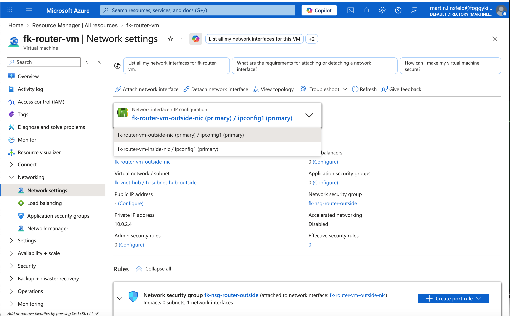

# Example 04: Dual-NIC NVA in Hub for Transit Routing and Forced Tunneling

In this example, we extend the hub-and-spoke routing pattern by deploying a **router VM with two NICs** in the Hub VNet.

This is a more realistic **NVA-style topology** than the single-NIC router used in Example 03:

- the **inside NIC** receives traffic from the spokes
- the **outside NIC** is used for outbound egress and NAT

This keeps the Azure route tables simple while making the router VM design closer to a real network appliance.

## Architecture Overview

This deployment creates:

- A Resource Group
- Three Virtual Networks:
  - `fk-vnet-hub` (`10.0.0.0/16`)
  - `fk-vnet-spoke1` (`10.1.0.0/16`)
  - `fk-vnet-spoke2` (`10.2.0.0/16`)
- Two subnets in the Hub:
  - `fk-subnet-hub-inside` (`10.0.1.0/24`)
  - `fk-subnet-hub-outside` (`10.0.2.0/24`)
- One subnet in each spoke:
  - `fk-subnet-spoke1` (`10.1.1.0/24`)
  - `fk-subnet-spoke2` (`10.2.1.0/24`)
- Bidirectional VNet peering:
  - Hub ↔ Spoke1
  - Hub ↔ Spoke2
- One router VM in the Hub:
  - `fk-router-vm`
  - inside NIC IP `10.0.1.4` by default
  - outside NIC IP `10.0.2.4` by default
- Two NIC-level NSGs for the router:
  - `fk-nsg-router-inside`
  - `fk-nsg-router-outside`
- One test VM in each spoke subnet:
  - `fk-spoke1-vm` (`10.1.1.4`)
  - `fk-spoke2-vm` (`10.2.1.4`)
- Two route tables:
  - `rt-spoke1`
  - `rt-spoke2`
- Four spoke routes:
  - inter-spoke route via the router inside NIC
  - default route `0.0.0.0/0` via the router inside NIC

With this design:

- traffic from `Spoke1` to `Spoke2` is sent to `10.0.1.4`
- traffic from `Spoke2` to `Spoke1` is sent to `10.0.1.4`
- outbound Internet traffic from both spokes is also sent to `10.0.1.4`
- the router VM forwards and NATs egress traffic out of its outside NIC

## Why Dual-NIC Matters

Example 03 used a single-NIC router VM, which is useful for a lab but mixes transit and egress on one interface.

This example introduces a more appliance-like pattern:

- **inside NIC**:
  - receives forwarded traffic from spoke route tables
  - is used as the Azure `VirtualAppliance` next hop
- **outside NIC**:
  - carries outbound egress traffic
  - is used by Linux NAT rules for Internet access

This produces a cleaner separation between transit traffic and egress traffic and is a better foundation for future NVA-style examples.

## Deployment Steps

Initialize and apply the configuration:

```bash
tofu init
tofu plan
tofu apply
```

No manual SSH public key input is required, because the example generates one automatically.

After deployment, Terraform will output:

- Hub, Spoke1, and Spoke2 VNet IDs
- Router VM ID
- Router inside and outside private IPs
- Router inside and outside NSG IDs
- Spoke1 VM ID and private IP
- Spoke2 VM ID and private IP
- Route table IDs
- Peering IDs

## Validation Ideas

After deployment, you can validate:

- Inter-spoke routing:
  - `ping 10.2.1.4` from `fk-spoke1-vm`
  - `ping 10.1.1.4` from `fk-spoke2-vm`
- Forced tunneling for Internet egress:
  - `curl https://api.ipify.org`
  - `curl https://ifconfig.me`
- Router VM network state:
  - `ip addr`
  - `ip route`
  - `iptables -t nat -S`
  - `iptables -S FORWARD`

Expected result:

- inter-spoke traffic should traverse the router inside NIC
- outbound Internet traffic should leave through the router outside NIC
- NAT should be attached only to the outside NIC

## Validated Result

The example was validated after a successful `tofu apply` by using Azure CLI `Run Command`.

Router VM validation:

```bash
az vm run-command invoke \
  -g fk-rg \
  -n fk-router-vm \
  --command-id RunShellScript \
  --scripts "ip -o -4 addr show; ip route; sysctl net.ipv4.ip_forward net.ipv4.conf.all.rp_filter net.ipv4.conf.default.rp_filter; iptables -t nat -S; iptables -S FORWARD"
```

Confirmed on `fk-router-vm`:

- `eth0 = 10.0.2.4/24` on the outside subnet
- `eth1 = 10.0.1.4/24` on the inside subnet
- default route via `10.0.2.1` on `eth0`
- `net.ipv4.ip_forward = 1`
- `net.ipv4.conf.all.rp_filter = 0`
- `net.ipv4.conf.default.rp_filter = 0`
- NAT rules present only on `eth0`:
  - `10.1.0.0/16 -> MASQUERADE`
  - `10.2.0.0/16 -> MASQUERADE`

Spoke validation:

```bash
az vm run-command invoke \
  -g fk-rg \
  -n fk-spoke1-vm \
  --command-id RunShellScript \
  --scripts "ping -c 2 10.2.1.4; curl -4S --max-time 20 https://api.ipify.org"

az vm run-command invoke \
  -g fk-rg \
  -n fk-spoke2-vm \
  --command-id RunShellScript \
  --scripts "ping -c 2 10.1.1.4; curl -4S --max-time 20 https://api.ipify.org"
```

Observed results:

- `fk-spoke1-vm -> 10.2.1.4`: `2/2` ICMP replies
- `fk-spoke2-vm -> 10.1.1.4`: `2/2` ICMP replies
- `curl https://api.ipify.org` returned `20.73.6.188` from both spoke VMs

This confirms:

- east-west routing between the spokes works through the dual-NIC router VM
- outbound HTTP/HTTPS egress from both spokes is centralized through the same outside NIC path
- NAT is applied on the outside interface, not on the inside interface

## Azure Portal Verification

The following screenshot documents the dual-NIC configuration of `fk-router-vm` in Azure Portal.



The screenshot confirms:

- `fk-router-vm-outside-nic` is attached as the **primary** NIC
- `fk-router-vm-inside-nic` is attached as the second NIC
- the outside NIC is placed in:
  - `fk-vnet-hub / fk-subnet-hub-outside`
- the outside NIC uses private IP:
  - `10.0.2.4`
- the outside NIC is protected by:
  - `fk-nsg-router-outside`

This matches the intended design of the example:

- the inside NIC is used as the Azure `VirtualAppliance` next hop for spoke route tables
- the outside NIC is used for default egress and NAT

## Design Notes

- This example is intentionally built as the next step after `03_forced_tunneling`
- The spokes still use Azure route tables with `VirtualAppliance` next hop
- The router VM now uses the multi-NIC support added to `terraform-az-fk-compute`
- The router inside NIC is the only address referenced by UDRs
- Linux guest routing adds explicit spoke CIDR routes through the inside interface
- NAT is applied only on the outside interface

## Cleanup

To remove all resources:

```bash
tofu destroy
```

## Summary

This example demonstrates:

- how to evolve from a single-NIC router lab to a dual-NIC NVA-style design
- how to keep Azure UDR logic simple while separating inside and outside interfaces
- how to combine UDR, VNet peering, NSG, and multi-NIC compute into a more realistic transit and egress topology

## Learn More

This example is part of the FoggyKitchen training ecosystem.

Continue your journey:

👉 https://foggykitchen.com/courses/azure-fundamentals-terraform-course/

## License

Licensed under the Universal Permissive License (UPL), Version 1.0.
