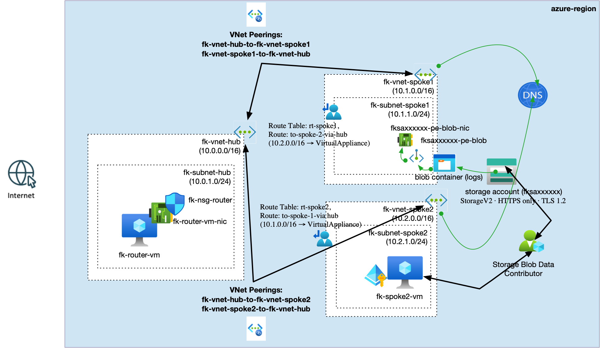
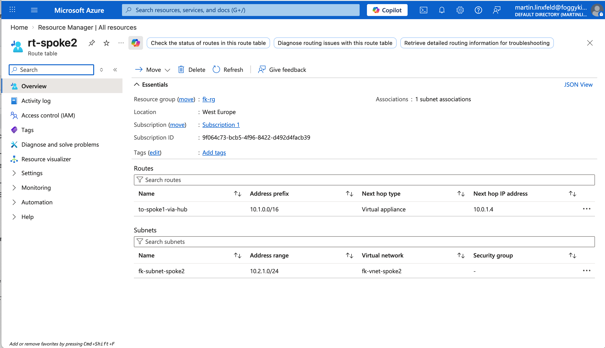
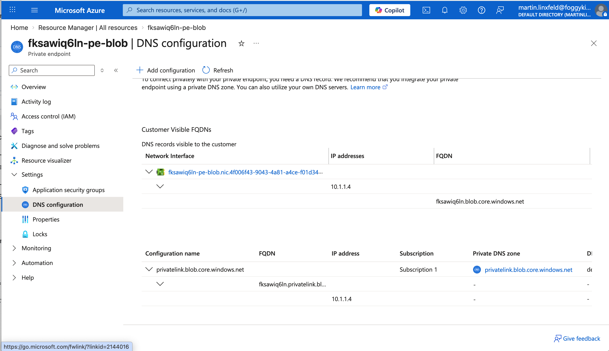
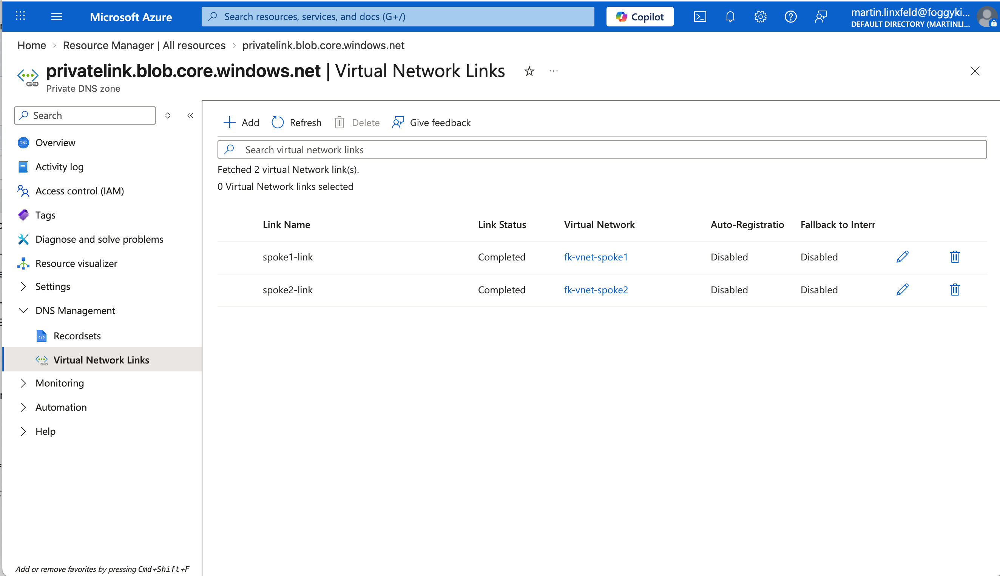
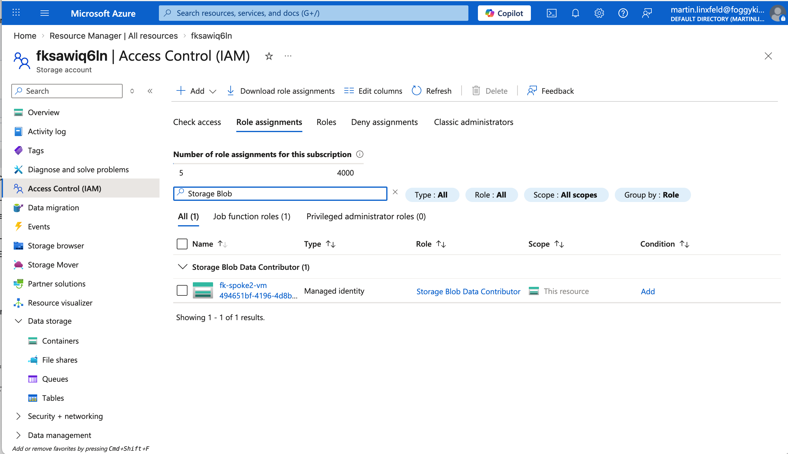
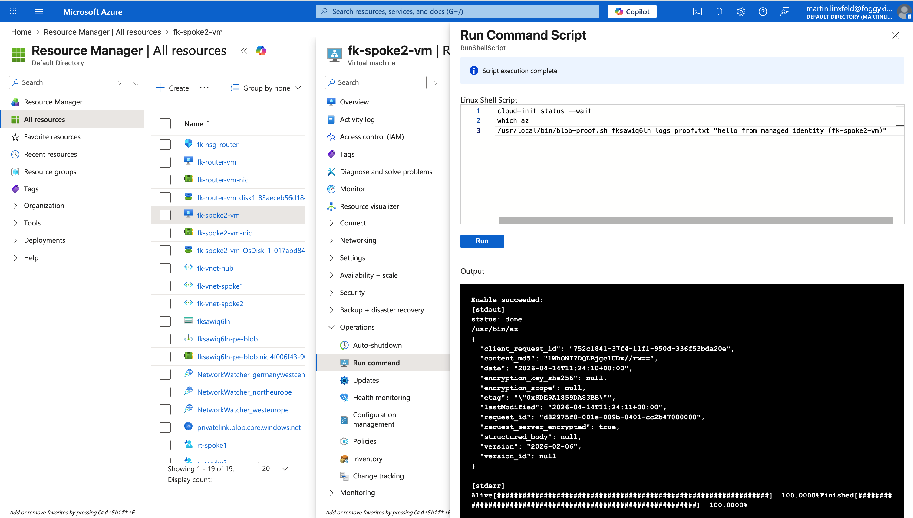
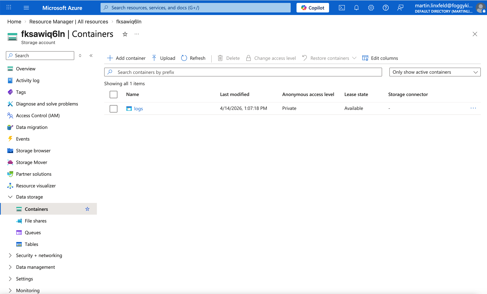

# Example 05: Hub-Spoke Private Endpoint Access

This example shows how to access a **Private Endpoint deployed in Spoke1** from a **client VM in Spoke2**, while preserving a **hub-and-spoke topology**.

The important point is that **Private DNS alone is not enough**. DNS can make `storageaccount.blob.core.windows.net` resolve to the private IP of the endpoint in Spoke1, but the actual packet flow still needs a working transit path:

- `Spoke2 -> Hub router VM -> Spoke1 subnet with the Private Endpoint`
- return traffic from the subnet in `spoke1` back to `Spoke2` must also traverse the hub

## Architecture Overview



The example deploys:

- one hub VNet with a single Linux router VM (`fk-router-vm`)
- one spoke VNet dedicated to the Blob Private Endpoint
- one spoke VNet with a Linux test VM (`fk-spoke2-vm`)
- one Storage Account with public network access disabled
- one Blob Private Endpoint in `spoke1`
- one Private DNS Zone: `privatelink.blob.core.windows.net`
- two VNet links for that Private DNS Zone, one to each spoke
- one system-assigned managed identity on `fk-spoke2-vm`
- one RBAC role assignment: `Storage Blob Data Contributor`
- one on-demand blob container created from `fk-spoke2-vm` during the validation step
- two route tables:
  - one for the subnet in `spoke1`
  - one for the client subnet in `spoke2`

## Why The Route Tables Matter

This example is intentionally built in a way that keeps the **hub-and-spoke model honest**.

There is no direct `Spoke1 <-> Spoke2` peering. Because of that:

- the client subnet in `spoke2` needs a UDR that sends `10.1.0.0/16` to the hub router VM
- the subnet in `spoke1` needs a return UDR that sends `10.2.0.0/16` to the hub router VM

Without the second route, the DNS lookup would still work, but the end-to-end flow could break because of asymmetric routing.

## Deployed Topology

```text
Spoke2 VM (10.2.1.4)
  -> rt-spoke2
  -> next hop 10.0.1.4
  -> Hub Router VM
  -> Spoke1 subnet with the Private Endpoint (10.1.1.0/24)
  -> Storage Account Blob Private Endpoint
```

DNS resolution path:

```text
<storage>.blob.core.windows.net
  -> CNAME to privatelink.blob.core.windows.net
  -> A record in Private DNS Zone
  -> private IP from the subnet in `spoke1`
```

## Files

- `networking.tf` builds the hub, both spokes, peerings, and UDRs
- `compute.tf` creates the hub router VM and the client VM in `spoke2`
- `rbac.tf` gives the VM managed identity write access to Blob Storage
- `storage.tf` creates the Storage Account
- `dns.tf` creates the Private DNS Zone and links it to both spoke VNets
- `private_endpoints.tf` creates the Blob Private Endpoint in `spoke1`

## Run

From the `examples/05_hub_spoke_private_endpoint_access` directory:

```bash
cp terraform.tfvars.example terraform.tfvars
tofu init
tofu plan
tofu apply
```

## What To Validate

After `tofu apply`, validate from `fk-spoke2-vm`:

1. DNS resolution:

```bash
nslookup <storage_account_name>.blob.core.windows.net
```

Expected result:
- the name resolves to the private IP of the Private Endpoint in `spoke1`

2. HTTPS reachability to the Blob endpoint:

```bash
curl -I https://<storage_account_name>.blob.core.windows.net/
```

Expected result:
- the command reaches the private endpoint over the hub transit path
- HTTP status may be `400` or `403`, which is fine for this test because the purpose is proving private connectivity, not authenticated blob access

3. Real Blob upload using the VM managed identity:

```bash
/usr/local/bin/blob-proof.sh <storage_account_name> logs proof.txt "hello from managed identity (fk-spoke2-vm)"
```

Expected result:
- the script creates the `logs` container if it does not already exist
- upload succeeds without storage account keys
- authorization is provided by `Storage Blob Data Contributor`
- network path still goes through Private DNS and the hub router

4. Optional route visibility:

```bash
traceroute <private_endpoint_ip>
```

The first hop should be the hub router VM private IP.

## Validated Result

The example was validated end-to-end after `tofu apply`:

- `nslookup` on `fk-spoke2-vm` resolved `<storage_account_name>.blob.core.windows.net` to the Private Endpoint IP in `spoke1`
- `curl -I https://<storage_account_name>.blob.core.windows.net/` reached the Blob endpoint over the private path and returned `HTTP/1.1 400`
- `cloud-init status --wait` completed successfully on `fk-spoke2-vm`
- `which az` returned `/usr/bin/az`
- `/usr/local/bin/blob-proof.sh <storage_account_name> logs proof.txt "hello from managed identity (fk-spoke2-vm)"` created the `logs` container and uploaded `proof.txt`

This proves:

- Private DNS resolution works across both spokes
- traffic from `spoke2` reaches the Private Endpoint in `spoke1` through the hub router VM
- managed identity + RBAC allow real Blob data-plane access without storage keys

## Azure Portal Verification

Route table in `spoke2` sends `10.1.0.0/16` to the hub router VM `10.0.1.4`.



The Blob Private Endpoint is deployed in `fk-subnet-spoke1` and exposes the private IP `10.1.1.4`.



The Private DNS zone `privatelink.blob.core.windows.net` is linked to both spoke VNets.



`fk-spoke2-vm` has `Storage Blob Data Contributor` on the Storage Account.



`Run Command` on `fk-spoke2-vm` shows successful managed-identity blob upload using `blob-proof.sh`.



The `logs` container is visible in the Storage Account after the upload.



## Design Notes

- This is a **routing example**, not just a Private Endpoint example
- The Storage Account is intentionally private-only (`public_network_access_enabled = false`)
- The blob container is created from inside `fk-spoke2-vm`, not by Terraform running on your workstation, because local Terraform cannot manage Blob data-plane objects through a private-only endpoint
- The Private DNS Zone is linked to both spoke VNets so the client in `spoke2` inherits the same Private Link name resolution
- The Private Endpoint lives in `fk-subnet-spoke1` with `private_endpoint_network_policies = "Disabled"`
- The hub router VM is the only transit path between the two spokes
- Blob authorization is handled separately through managed identity + RBAC

## Cleanup

```bash
tofu destroy
```

## Summary

Use this example when you want to demonstrate that:

- a Private Endpoint can be consumed from another spoke
- Private DNS can publish the same private address into multiple VNets
- hub-and-spoke still requires a real transit path
- UDR on both sides is what makes the cross-spoke flow deterministic
- managed identity + RBAC can prove real blob access without storage keys
